# Duet

Десктоп-плеер для Windows, который держит **VK Музыку** и **Яндекс.Музыку** в
одном окне: общий поиск, общая очередь, общая библиотека — и мини-плеер поверх
всех окон, когда смотришь в другое приложение.

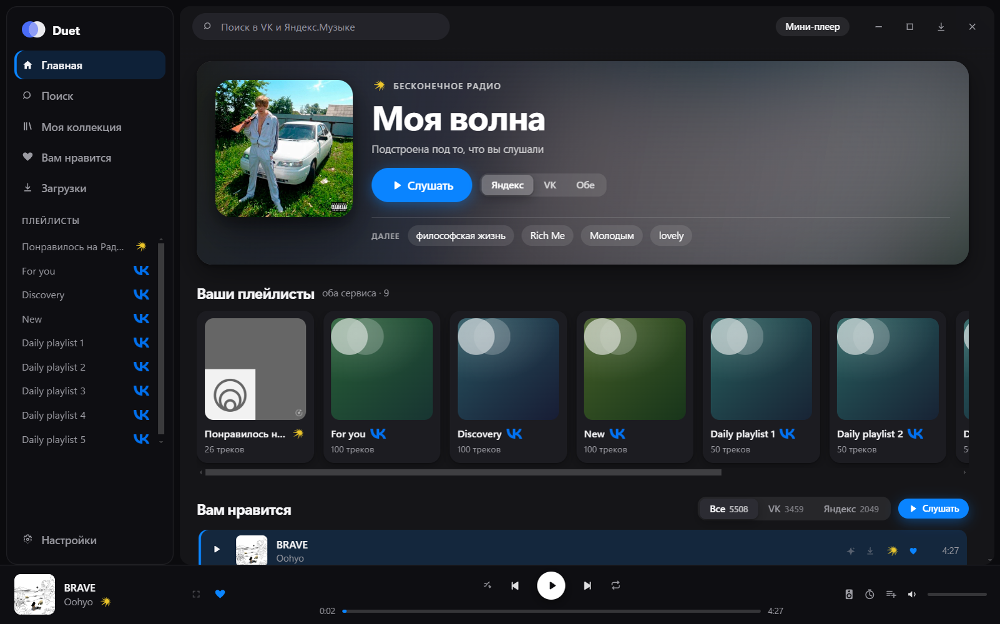

## Что умеет

- **Два сервиса как один каталог.** Поиск, плейлисты и избранное обоих сервисов
  в общих списках; у каждого трека видно, откуда он.
- **«Моя волна»** каждого сервиса — и режим «Обе», где две станции идут
  вперемешку, с отсевом повторов. Волна переживает перезапуск: «играть» в
  мини-плеере включает ту же станцию, не открывая окна, а на Главной сразу
  видно обложку и что заиграет дальше.
- **Волна по треку** — бесконечная станция вокруг любой песни, у обоих
  сервисов. Начинается с неё же и продолжается, уходя всё дальше.
- **Свой плеер.** Очередь, перемешивание, повтор, перетаскивание треков —
  очередь одна на оба сервиса и не сбрасывается при переключении экранов.
- **Текст песни** с подсветкой строки — слова ищутся у обоих сервисов и в
  открытой базе, так что метки времени находятся и для треков VK, у которого
  их нет.
- **Один сервис выручает другой.** Трек недоступен или его сервис не подключён —
  играет та же песня из второго.
- **«Нравится» и «не нравится»** у обоих сервисов.
- **Скачивание** с обоих сервисов, в том числе автоматическое, с лимитом места
  и выбором папки. Скачанное играет без сети.
- **Мини-плеер поверх окон** — четыре вида, с настройкой позиции, прозрачности,
  раскрытия по наведению и того, что делает двойной щелчок.
- **Оформление под себя** — тема, цвет акцента, плотность списков, количество
  движения, вид главной и вид плеера.
- **Свои плейлисты** — единственное место, где треки VK и Яндекса лежат в одном
  списке: сервисы чужие треки не принимают.
- **Слушать вместе** — приглашение по ссылке: второй слушатель подхватывает ваш
  трек с вашей секунды и идёт следом.
- **Duet Jam** — общая сессия по второй, отдельной ссылке: участники сами
  добавляют треки в очередь и переключают. Ссылку можно сменить одной кнопкой.
- **Обновление с GitHub** — само, при выходе из приложения.
- Таймер сна (с усыплением компьютера), выбор устройства вывода, глобальные
  горячие клавиши, автозапуск, статус в Discord.

## Библиотека

«Вам нравится» — это избранное обоих сервисов одним списком, отсортированным
как один плейлист. Сколько чего внутри, написано под названием.

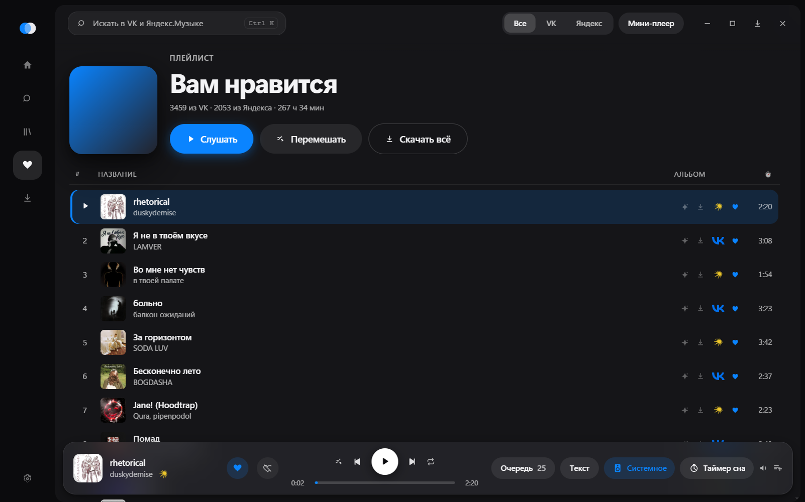

У строки под рукой всё, что обычно приходится искать в меню: похожее,
скачивание, сердечко. Значок сервиса показывает, откуда трек, а фильтр в
титульной строке оставляет на экране только VK или только Яндекс — сразу на
всех экранах, а не на том, где его переключили.

## Поиск

Один запрос — оба сервиса. Лучший результат, треки, альбомы, исполнители и
плейлисты; переключатель сверху оставляет один раздел.

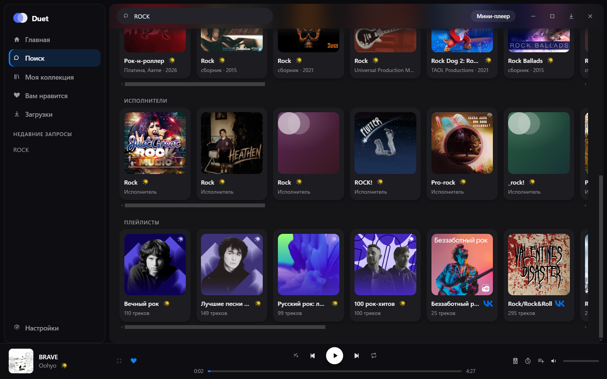

## Плеер во весь экран

Три вида на выбор. **«Обложка и очередь»** — очередь и текст песни рядом, фон
подкрашен обложкой.

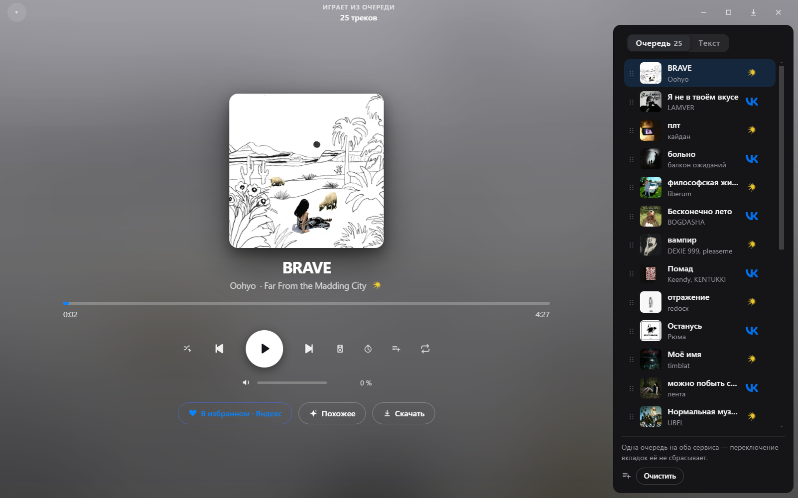

**«Во всё окно»** убирает всё лишнее: обложка расплывается по экрану, а текст
идёт крупно и подсвечивается по ходу песни. По строке можно щёлкнуть и
перескочить к этому месту.

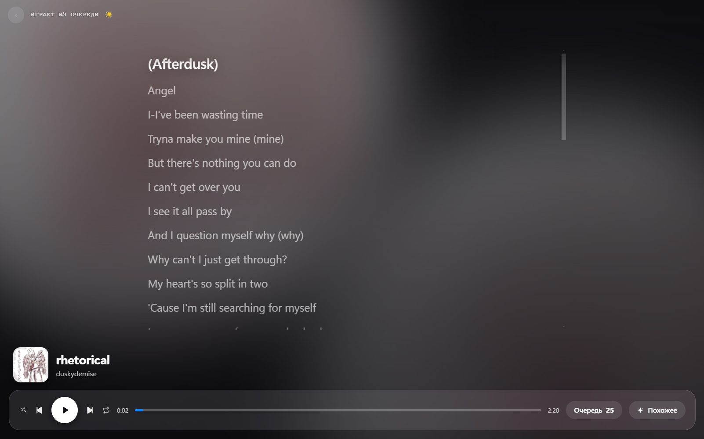

Слова ищутся по очереди: сервис самого трека, потом второй сервис про ту же
песню, потом открытая база [LRCLIB](https://lrclib.net). Размеченный текст
всегда важнее простого — подсветка в такт дороже, чем то, кто её дал.

Это и есть ответ на то, что у VK меток времени нет вовсе: его треки получают
подсветку от Яндекса, где та же песня размечена. Замерено на фонотеке — из
восьми треков шесть идут с метками, и два из них пришли из VK.

Пока песня идёт, текст едет сам и держит поющуюся строку посередине. Если
листать его руками, он остаётся там, где оставили, и возвращается к строке
через десять секунд — срок настраивается, а ноль отключает возврат совсем:
дочитать куплет важнее, чем не отстать.

Если меток нет нигде, показывается просто текст. Расставить их самим нечем:
подсветка «по длине песни» разошлась бы с первым же проигрышем и врала бы тем
убедительнее, чем ровнее выглядит.

## Оформление

Тема — светлая, тёмная или вслед за Windows. Меняется сразу и в мини-плеере
тоже.

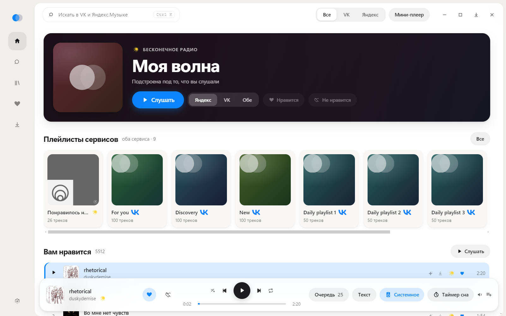

Цвет акцента берётся из палитры, задаётся свой или снимается с обложки
играющего трека. Его берёт и значок Duet — в окне и в трее.

<table>
  <tr>
    <td width="50%"></td>
    <td width="50%">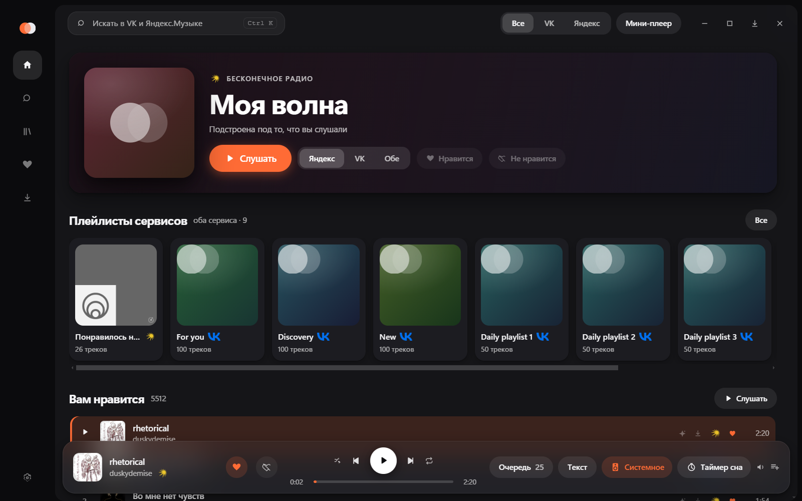</td>
  </tr>
</table>

Вид главной, палитра, тема и плотность списков — в одном месте.

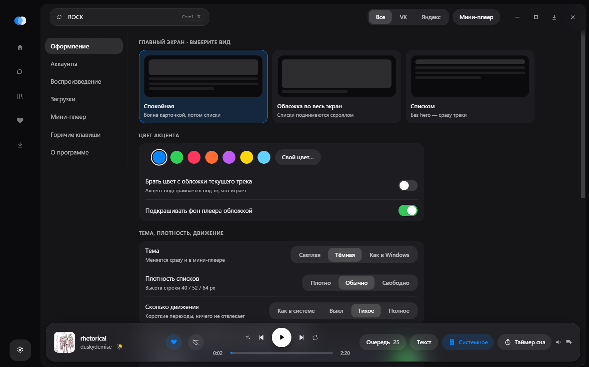

Блоки главной переставляются перетаскиванием и выключаются по одному, у плеера
свой набор видов, а движение настраивается по отдельности: общий уровень плюс
свой выбор для появления плеера, живой обложки «Моей волны» и перехода между
экранами. Обложка умеет переливаться водой, экраны — собираться из вещества, а
сердечко при нажатии рассыпается искрами в цвете того, что играет. Всё это
выключается по отдельности: движение, которое нельзя унять, — это не украшение.

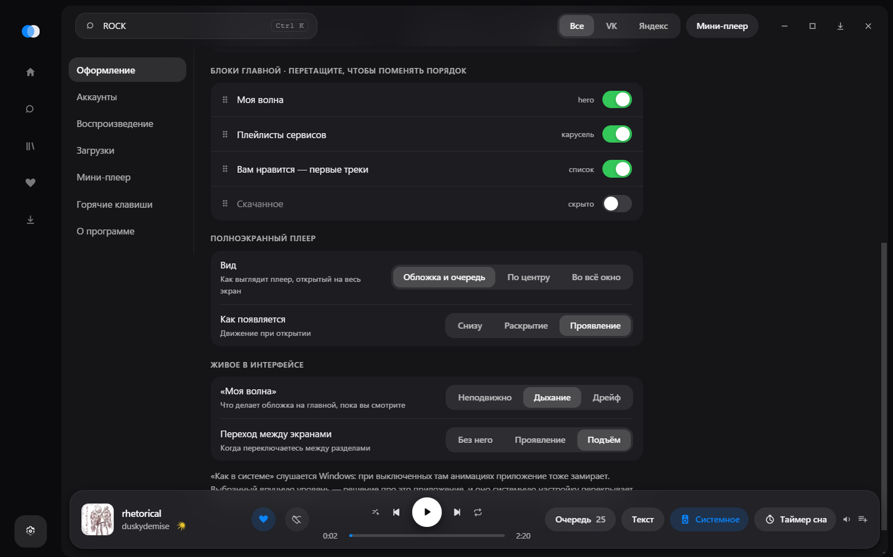

По умолчанию приложение слушается настройки анимаций Windows: если вы их там
выключили, оно замирает вместе с системой. Выбранный вручную уровень —
осознанное решение про это приложение, и оно системную настройку перекрывает.

## Мини-плеер

Появляется, когда окно свёрнуто или просто перестало быть активным — это
настраивается, как и всё остальное. Плита раскрывается по наведению, её можно
таскать мышью (в том числе на другой монитор) или закрепить на месте, а двойной
щелчок по ней либо раскрывает её, либо сразу открывает плеер во весь экран.

<table>
  <tr>
    <td width="50%" valign="top">
      <br>
      <b>Полоса</b> — обложка, название, транспорт. Незаметная и широкая.
    </td>
    <td width="50%" valign="top">
      <br>
      <b>Пилюля</b> — самая маленькая: обложка и три кнопки.
    </td>
  </tr>
  <tr>
    <td valign="top">
      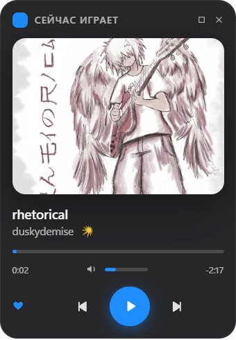<br>
      <b>Карточка</b> — крупная обложка, перемотка, громкость, сердечко.
    </td>
    <td valign="top">
      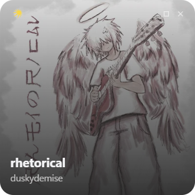<br>
      <b>Обложка</b> — почти одна картинка, подпись поверх неё.
    </td>
  </tr>
</table>

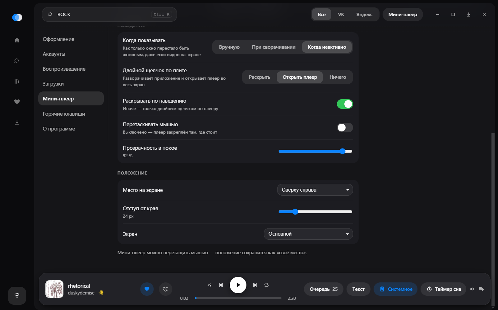

## Один сервис выручает другой

У сервисов разные каталоги, и одна и та же песня есть то у обоих, то у одного.
Поэтому трек, который не играет — снят из каталога, или его сервис вовсе не
подключён, — не заканчивается тишиной: Duet ищет ту же песню у второго сервиса
и играет её. Подменяется строка очереди целиком, а не одна ссылка на поток:
лайк, текст и подпись в Discord должны указывать на то, что звучит.

Узнаются треки по огрублённому имени плюс длительности: имени мало — у песни
бывают концертная версия, ремикс и чужой кавер под тем же названием.
Проверено на фонотеке: двенадцать треков из двенадцати нашли себя у соседа,
расхождение по длительности от 10 до 540 миллисекунд.

Отсюда же чинится совместное прослушивание: раньше трек ведущего из
неподключённого сервиса просто не играл, а теперь у гостя заиграет своя копия.

## «Не нравится»

У Яндекса это настоящая отметка: она уходит в сервис, и станция перестаёт
предлагать похожее.

У VK такого метода нет ни под каким именем — проверены семнадцать, от
`audio.dislike` до отзыва о микшированной волне; отвечает только
`newsfeed.ignoreItem`, а она прячет запись из ленты новостей, а не трек из
рекомендаций. Кнопка при этом нужна ровно за тем же: больше не слышать этот
трек. Поэтому список отвергнутого Duet держит у себя и вычёркивает такие треки
из волны сам. На стороне VK рекомендации остаются прежними — обещание кнопки
выполняется, но не больше.

## Слушать вместе

Ссылка-приглашение и кнопка в статусе Discord — в настройках воспроизведения.

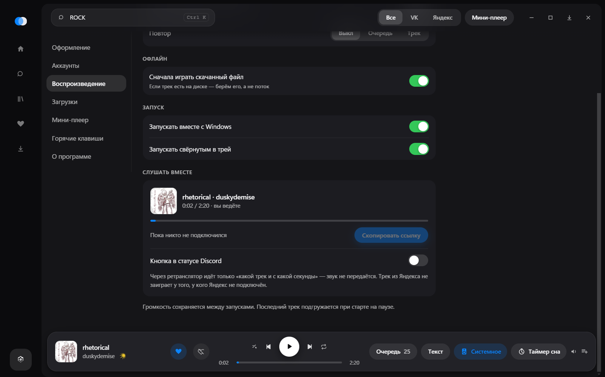

```
ссылка или статус Discord → страница-приглашение → duet://join/<код> → Duet у гостя
```

Если у гостя приложения нет, страница предложит скачать его из Releases.
Через ретранслятор идёт только «какой трек и с какой секунды» — **звук не
передаётся**: каждый слушает из своего аккаунта. Отсюда главное ограничение:
трек из Яндекса не заиграет у того, у кого Яндекс не подключён, и Duet скажет
об этом вместо того, чтобы молча переключить подпись.

Гость отстаёт примерно на секунду — это загрузка трека; дальше расхождение не
растёт, потому что он идёт по своим часам, а перемотка случается только при
расхождении больше двух секунд. Обрыв связи не заканчивает сессию: Duet
восстанавливает поток и говорит об этом, а сдаётся только через две минуты
безуспешных попыток.

У гостя перелистывание отключено — очередь чужая, и «следующий» сбивал бы с
толку. Его пауза означает «подключиться заново»: чаще всего её жмут именно
тогда, когда звук разошёлся. Следование прекращается, когда гость включает
что-то своё.

## Duet Jam

У приглашения два вида, и разница между ними в правах, а не в оформлении.
Обычная ссылка зовёт послушать. Ссылка участника зовёт участвовать: по ней
добавляют треки в общую очередь и переключают — у всех сразу.

```
ссылка слушателя   → ?join=<код>
ссылка участника   → ?join=<код>&jam=<пропуск>
```

Пропуск — второй секрет рядом с кодом, и это не украшение. Код знают все, кому
когда-либо давали послушать; если бы права держались на нём, отозвать их было
бы нечем. «Сменить ссылку» выдаёт новый пропуск: прежние ссылки участников
перестают работать сразу, а слушатели остаются на месте и музыка не прерывается.

Играет всё равно только у ведущего — он один, у кого есть звук и очередь.
Поэтому участники не меняют состояние, а просят, и ретранслятор их просьбы
только пересылает: второго источника правды не заводится, а значит, нечему и
расходиться.

Трек едет описанием, а не номером. Номера у сервисов свои, и добавленный из VK
трек нечем открыть тому, у кого только Яндекс, — поэтому ведущий ищет
предложенное у себя тем же поиском, которым один сервис выручает другой.

Ретранслятор — [`server/relay.mjs`](server/relay.mjs), без зависимостей и без
хранилища; как поднять его на своём сервере, написано в
[`server/README.md`](server/README.md).

## Установка и обновление

Готовый установщик — в [Releases](../../releases/latest):
`Duet-<версия>-setup.exe`. Подписи у сборки нет.

Дальше Duet обновляется сам: смотрит на GitHub, не вышло ли что-то новее,
скачивает заранее и ставит при выходе из приложения — вы закрываете одну
версию, а открываете следующую. Проверка вручную, немедленный перезапуск и
выключатель — в «О программе».

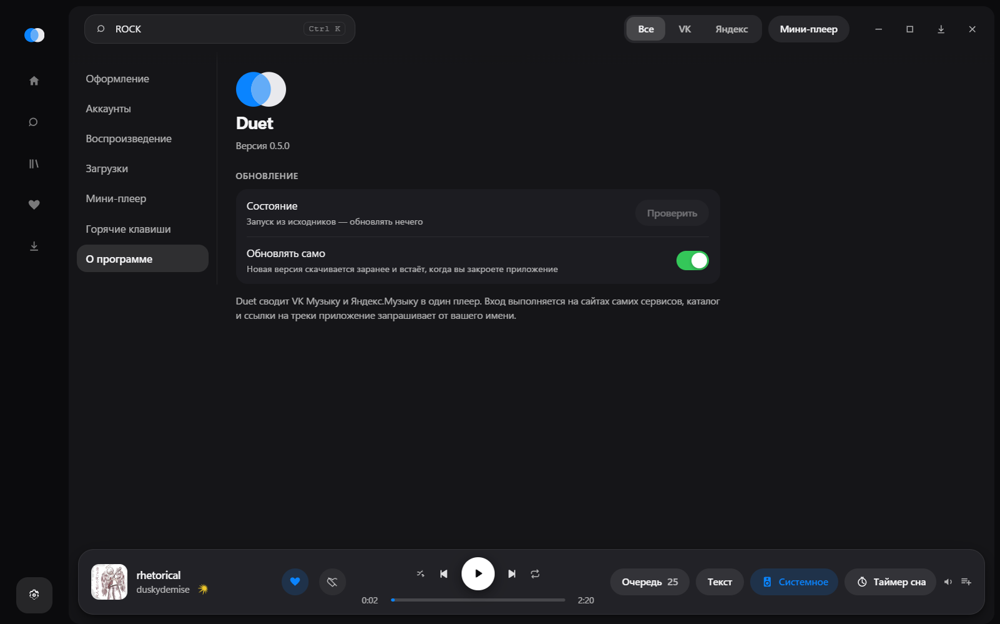

При первом запуске приложение попросит войти в сервисы. Вход происходит **на
настоящих страницах VK и Яндекса внутри приложения**: логин и пароль оно не
видит и не хранит, а только сессию, которую выдал сервис. Токен Яндекса лежит
зашифрованным средствами Windows, cookies VK — в отдельном разделе Electron.

## Как это устроено

Приложение не встраивает веб-плееры сервисов и не кликает по их кнопкам — оно
**само является плеером**. Сервисы для него — это каталог и ссылки на потоки.

```
main (Node)                     renderer
├── sources/                    ├── shell   — окно приложения
│   ├── yandex/  api + OAuth    ├── mini    — плеер поверх окон
│   └── vk/      cookies        └── audio   — скрытое окно с <audio>
├── player/engine.ts  очередь и транспорт
├── downloads/        загрузки и HLS
├── library/          свои плейлисты и кэш каталога
├── together/         совместное прослушивание
└── updates.ts        обновление с GitHub
```

Несколько решений, которые стоит знать, прежде чем читать код:

- **Звук живёт в скрытом окне.** Элемент `<audio>` лежит в отдельном
  renderer-процессе, а главный процесс владеет состоянием и рассылает его в
  окно приложения, мини-плеер и трей. Так переключение экранов не прерывает
  воспроизведение.
- **VK отдаёт зашифрованный HLS.** Для воспроизведения его разбирает `hls.js`;
  для скачивания приложение расшифровывает сегменты и демультиплексирует
  транспортный поток само — см. [`src/main/downloads/hls.ts`](src/main/downloads/hls.ts).
- **Следующий трек готовится заранее.** Аудиоэлементов два: пока играет один,
  второй уже держит то, что заиграет следующим, — смена трека подменяет их
  местами. Измерено: 117–174 мс тишины между треками превратились в 2–4 мс.
- **Библиотека переживает закрытие.** Обход фонотеки — секунды (у VK это
  восемнадцать страниц), поэтому списки лежат на диске и при следующем запуске
  показываются сразу, а обход идёт фоном и подменяет их. Запуск до готовой
  библиотеки: 4,4 с против 0,8 с.
- **Списки виртуализованы.** В библиотеке бывают тысячи треков; в DOM попадают
  только видимые строки. Важна и первая отрисовка: пока список до замера
  показывал сам себя целиком, открытие «Вам нравится» стоило 2,7 секунды
  против нынешних 45 миллисекунд.
- **Очередь передаётся в окна только когда меняется.** Позиция тикает четыре
  раза в секунду, и слать с ней всю очередь было бы расточительно. Мини-плееру
  не идёт и она: он показывает один трек, его и получает.
- **Загрузка, которая молчит, — тоже неудача.** Трек может не заиграть без
  всякой ошибки: элемент вечно ждёт данных. Через восемь секунд тишины плеер
  пробует иначе — мимо скачанного файла, затем по очереди дальше.
- **Оформление собрано из токенов, движение — из атрибутов.** Компоненты не
  знают ни цветов, ни длительностей: и светлая тема, и выбор акцента, и выбор
  анимаций меняют значения, а не правила. Отдельно живут поверхности «на
  обложке» — волна и полноэкранный плеер остаются тёмными в любой теме, потому
  что лежат на самой картинке.
- **Значок в трее рисуется, а не лежит файлом.** Марка Duet — два круга, и в
  трее она считается теми же формулами, что и в окне: иначе цвет менялся бы
  только в половине мест.
- **Волна Яндекса требует обратной связи.** Станция не двигается от одного лишь
  курсора: ей нужно сообщать, что трек начат и дослушан, иначе каждый запуск
  начинается с одного и того же трека.

## Сборка из исходников

```bash
npm ci
npm run dev      # запуск в режиме разработки
npm run build    # проверка типов и сборка
npm run dist     # установщик NSIS в release/
npm run release  # то же плюс выкладывание в Releases (нужен GH_TOKEN)
npm run perf     # замер на своей библиотеке (--fresh — с нуля)
```

`npm run perf` копирует профиль без кэшей во временную папку и прогоняет по
нему сценарий: запуск, чтение каталога, двенадцать смен трека, прокрутка
списка, статус Discord. Печатает таблицу — по ней и видно, стало быстрее или
только кажется. Рабочий профиль он не трогает. У него же живут отдельные
проверки: `--probe together` гоняет совместное прослушивание через настоящий
ретранслятор, `--probe readme` пересобирает снимки для этого файла.

Нужен Node 18+. Установщик собирается только на Windows: NSIS использует
средства самой системы. По тегу `v*` то же самое делает
[GitHub Actions](.github/workflows/release.yml) и прикладывает к релизу `.exe`
и `latest.yml` — второй файл обязателен, по нему работает обновление.

## Оговорки

Приложение обращается к тем же внутренним точкам VK и Яндекса, что и их
собственные клиенты, от имени вошедшего пользователя. Это не публичные API:
они могут измениться в любой момент, а такое использование может расходиться с
пользовательскими соглашениями сервисов. Проект сделан для себя; используйте на
свой страх и риск.

Загрузки хранятся в виде обычных файлов на вашем диске и предназначены для
личного прослушивания.
