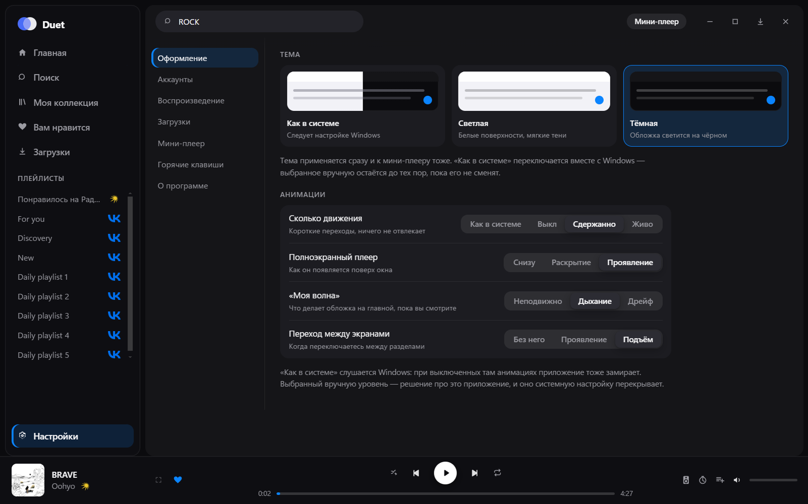

# Duet

Десктоп-плеер для Windows, который держит **VK Музыку** и **Яндекс.Музыку** в
одном окне: общий поиск, общая очередь, общая библиотека — и мини-плеер поверх
всех окон, когда смотришь в другое приложение.


## Что умеет

- **Два сервиса как один каталог.** Поиск, плейлисты и избранное обоих сервисов
  в общих списках; у каждого трека видно, откуда он.
- **«Моя волна»** каждого сервиса — и режим «Обе», где две станции идут
  вперемешку, с отсевом повторов.
- **Свой плеер.** Очередь, перемешивание, повтор, перетаскивание треков —
  очередь одна на оба сервиса и не сбрасывается при переключении вкладок.
- **Скачивание** с обоих сервисов, в том числе автоматическое, с лимитом места
  и выбором папки. Скачанное играет без сети.
- **Мини-плеер поверх окон** — четыре вида, с настройкой позиции, прозрачности,
  раскрытия по наведению и того, что делает двойной щелчок.
- **Светлая и тёмная тема** и **настраиваемые анимации** — либо вслед за
  системой, либо как решите сами.
- **Похожие треки** по звёздочке у любого трека и **тексты песен** рядом с
  очередью.
- **Свои плейлисты** — единственное место, где треки VK и Яндекса лежат в одном
  списке: сервисы чужие треки не принимают.
- **Слушать вместе** — приглашение через статус Discord: второй слушатель
  подхватывает ваш трек с вашей секунды и идёт следом.
- Таймер сна (с усыплением компьютера), выбор устройства вывода, глобальные
  горячие клавиши, автозапуск, статус в Discord.

## Мини-плеер

Появляется, когда окно свёрнуто или просто перестало быть активным — это
настраивается, как и всё остальное. Плита раскрывается по наведению, её можно
таскать мышью или закрепить на месте, а двойной щелчок по ней либо раскрывает
её, либо сразу открывает плеер во весь экран.

<table>
  <tr>
    <td width="50%" valign="top">
      <br>
      <b>Полоса</b> — обложка, название, транспорт. Незаметная и широкая.
    </td>
    <td width="50%" valign="top">
      <br>
      <b>Пилюля</b> — самая маленькая: обложка и три кнопки.
    </td>
  </tr>
  <tr>
    <td valign="top">
      <br>
      <b>Карточка</b> — крупная обложка, перемотка, громкость, сердечко.
    </td>
    <td valign="top">
      <br>
      <b>Обложка</b> — почти одна картинка, подпись поверх неё.
    </td>
  </tr>
</table>

## Оформление

Тема — светлая, тёмная или вслед за Windows. Меняется сразу и в мини-плеере
тоже.


Анимации настраиваются по отдельности: общий уровень движения плюс свой выбор
для появления полноэкранного плеера, живой обложки «Моей волны» и перехода
между экранами.



По умолчанию приложение слушается настройки анимаций Windows: если вы их там
выключили, оно замирает вместе с системой. Выбранный вручную уровень —
осознанное решение про это приложение, и оно системную настройку перекрывает.

## Поиск

Один запрос — оба сервиса. Лучший результат, треки, альбомы, исполнители и
плейлисты; вкладки сверху оставляют на экране только один сервис.


## Полноэкранный плеер

Очередь и текст песни рядом, фон — размытая обложка.


## Установка

Готовый установщик — в [Releases](../../releases/latest):
`Duet-<версия>-setup.exe`. Подписи у сборки нет.

При первом запуске приложение попросит войти в сервисы. Вход происходит **на
настоящих страницах VK и Яндекса внутри приложения**: логин и пароль оно не
видит и не хранит, а только сессию, которую выдал сервис. Токен Яндекса лежит
зашифрованным средствами Windows, cookies VK — в отдельном разделе Electron.

## Слушать вместе

Кнопка появляется в вашем статусе Discord, когда включено
«Разрешить слушать вместе» (Настройки → Воспроизведение → DISCORD).

```
статус Discord → страница-приглашение → duet://join/<код> → Duet у гостя
```

Если у гостя приложения нет, страница предложит скачать его из Releases.
Через ретранслятор идёт только «какой трек и с какой секунды» — **звук не
передаётся**: каждый слушает из своего аккаунта. Отсюда главное ограничение:
трек из Яндекса не заиграет у того, у кого Яндекс не подключён.

Гость отстаёт примерно на секунду — это загрузка трека; дальше расхождение не
растёт, потому что он идёт по своим часам, а перемотка случается только при
расхождении больше двух секунд. Следование прекращается, когда гость ставит
паузу или включает что-то своё.

Ретранслятор — [`server/relay.mjs`](server/relay.mjs), без зависимостей и без
хранилища; как поднять его на своём сервере, написано в
[`server/README.md`](server/README.md).

## Как это устроено

Приложение не встраивает веб-плееры сервисов и не кликает по их кнопкам — оно
**само является плеером**. Сервисы для него — это каталог и ссылки на потоки.

```
main (Node)                     renderer
├── sources/                    ├── shell   — окно приложения
│   ├── yandex/  api + OAuth    ├── mini    — плеер поверх окон
│   └── vk/      cookies        └── audio   — скрытое окно с <audio>
├── player/engine.ts  очередь и транспорт
├── downloads/        загрузки и HLS
├── library/          свои плейлисты и кэш каталога
└── together/         совместное прослушивание
```

Несколько решений, которые стоит знать, прежде чем читать код:

- **Звук живёт в скрытом окне.** Элемент `<audio>` лежит в отдельном
  renderer-процессе, а главный процесс владеет состоянием и рассылает его в
  окно приложения, мини-плеер и трей. Так переключение экранов не прерывает
  воспроизведение.
- **VK отдаёт зашифрованный HLS.** Для воспроизведения его разбирает `hls.js`;
  для скачивания приложение расшифровывает сегменты и демультиплексирует
  транспортный поток само — см. [`src/main/downloads/hls.ts`](src/main/downloads/hls.ts).
- **Следующий трек готовится заранее.** Аудиоэлементов два: пока играет один,
  второй уже держит то, что заиграет следующим, — смена трека подменяет их
  местами. Измерено: 117–174 мс тишины между треками превратились в 2–4 мс.
- **Библиотека переживает закрытие.** Обход фонотеки — секунды (у VK это
  восемнадцать страниц), поэтому списки лежат на диске и при следующем запуске
  показываются сразу, а обход идёт фоном и подменяет их. Запуск до готовой
  библиотеки: 4,4 с против 0,8 с.
- **Списки виртуализованы.** В библиотеке бывают тысячи треков; в DOM попадают
  только видимые строки. Важна и первая отрисовка: пока список до замера
  показывал сам себя целиком, открытие «Вам нравится» стоило 2,7 секунды
  против нынешних 45 миллисекунд.
- **Очередь передаётся в окна только когда меняется.** Позиция тикает четыре
  раза в секунду, и слать с ней всю очередь было бы расточительно. Мини-плееру
  не идёт и она: он показывает один трек, его и получает.
- **Загрузка, которая молчит, — тоже неудача.** Трек может не заиграть без
  всякой ошибки: элемент вечно ждёт данных. Через восемь секунд тишины плеер
  пробует иначе — мимо скачанного файла, затем по очереди дальше.
- **Оформление собрано из токенов, движение — из атрибутов.** Компоненты не
  знают ни цветов, ни длительностей: и светлая тема, и выбор анимаций меняют
  значения, а не правила. Отдельно живут поверхности «на обложке» — волна и
  полноэкранный плеер остаются тёмными в любой теме, потому что лежат на самой
  картинке.
- **Волна Яндекса требует обратной связи.** Станция не двигается от одного лишь
  курсора: ей нужно сообщать, что трек начат и дослушан, иначе каждый запуск
  начинается с одного и того же трека.

## Сборка из исходников

```bash
npm ci
npm run dev     # запуск в режиме разработки
npm run build   # проверка типов и сборка
npm run dist    # установщик NSIS в release/
npm run perf    # замер на своей библиотеке (--fresh — с нуля)
```

`npm run perf` копирует профиль без кэшей во временную папку и прогоняет по
нему сценарий: запуск, чтение каталога, двенадцать смен трека, прокрутка
списка, статус Discord. Печатает таблицу — по ней и видно, стало быстрее или
только кажется. Рабочий профиль он не трогает.

Нужен Node 18+. Установщик собирается только на Windows: NSIS использует
средства самой системы. По тегу `v*` то же самое делает
[GitHub Actions](.github/workflows/release.yml) и прикладывает `.exe` к релизу.

## Оговорки

Приложение обращается к тем же внутренним точкам VK и Яндекса, что и их
собственные клиенты, от имени вошедшего пользователя. Это не публичные API:
они могут измениться в любой момент, а такое использование может расходиться с
пользовательскими соглашениями сервисов. Проект сделан для себя; используйте на
свой страх и риск.

Загрузки хранятся в виде обычных файлов на вашем диске и предназначены для
личного прослушивания.
